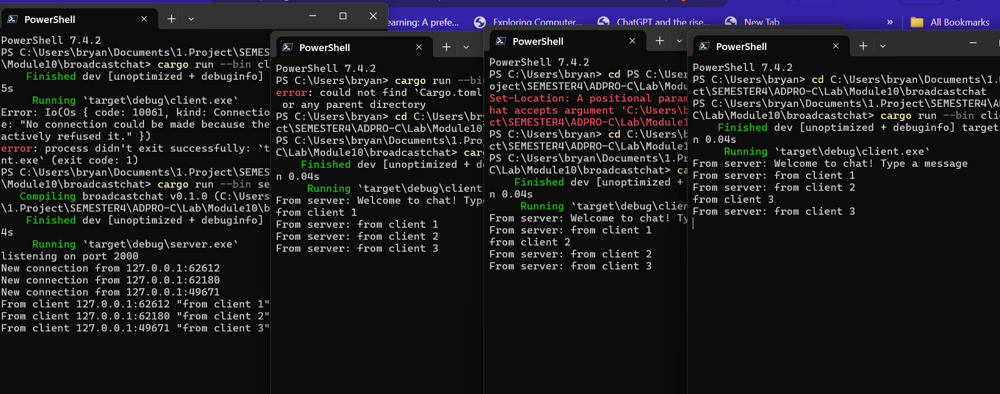

# 2.1. Original code of broadcast chat

To run the WebSocket chat application, I start the server using the command `cargo run --bin server` in the terminal. This makes a server listen on port 2000 for WebSocket connections. Then, I start each client using `cargo run --bin client`. Once the clients are connected, they talk through the server. When a client writes a message, it goes to the server. The server sends this message to all connected clients, so everyone sees it. The program uses Tokio framework's asynchronous operations to handle many clients at once, without slowing down. So, each client's message can be seen by everyone, making a chat where everyone interacts.

# 2.2. Modifying the websocket port
 

I changed the server's listening port to 8080 in my WebSocket chat app. Both the server and client settings were updated to match. The server runs on port 8080. It's working fine, showing messages like "listening on port 8080" and logs of new connections from different clients. On the client side, they're connected to the right server address "ws://127.0.0.1:8080". Messages are exchanged successfully. When a client connects, it gets a welcome message saying "Welcome to chat! Type a message." Messages typed on one client are sent to all others, proving the broadcast system works over WebSocket. This test proves the app handles many clients and broadcasts messages properly with the new port setting.

# 2.3. Small changes. Add some information to client
 
In the recent updates to the WebSocket chat app, I added sender info like IP address and port to give more context to messages. In the server.rs file, I changed the message format to include the sender's address along with the message content. In the client.rs file, I put a custom label ("BryanJeshua's Computer – From server:") before each received message to personalize the console output. This message format improvement is important for a few reasons. First, it makes the chat system clearer by showing which client (identified by IP and port) sent each message. This is helpful for debugging or when multiple users are chatting. Second, the custom label in the client's output makes messages easier to tell apart, improving readability and user experience, especially in personal or casual chats.

